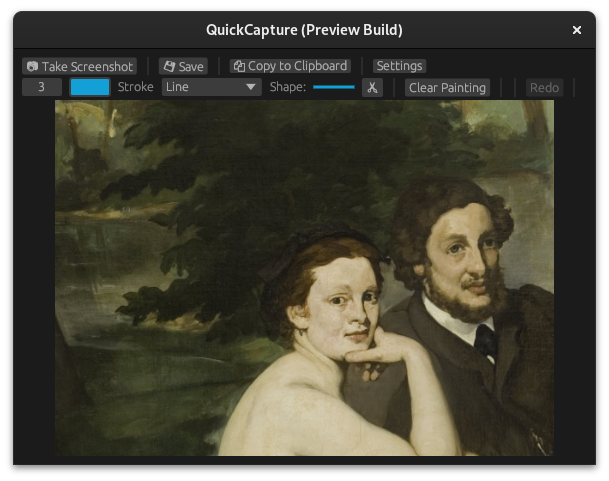
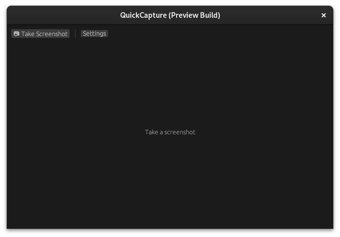
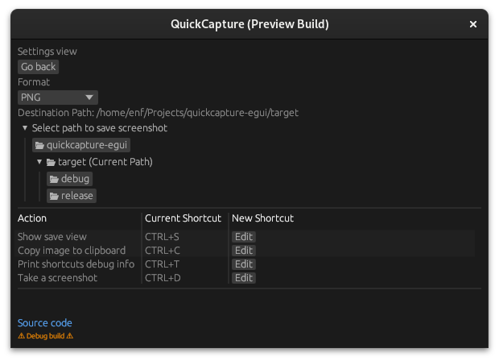
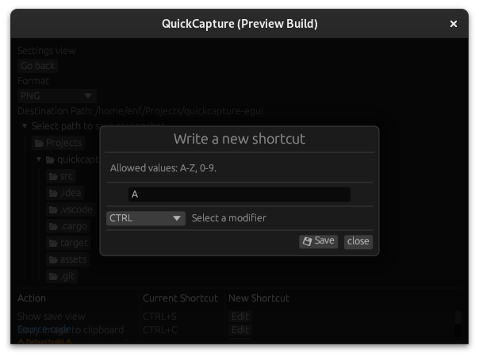

# QuickCapture
A multi platform screenshot utility written in Rust. 
Optional project for [Programmazione di sistema [02GRSOV]](https://didattica.polito.it/pls/portal30/gap.pkg_guide.viewGap?p_cod_ins=02GRSOV&p_a_acc=2023&p_header=S&p_lang=IT&multi=N) course at Politecnico di Torino (Italy). Final evaluation: 6 out of 6.



The program has been ran and tested in
- Arch Linux, Gnome 45.4, Wayland, kernel 6.7.8-arch1-1
- macOS Sonoma 13
- Windows 11 (on ARM e x64)

## Features
- Multiscreen capture (partial or full-screen)
- Delay timer: delays the capture for the desired time in milliseconds
- Easily accessible User Interface - egui 0.22.0 (egui-extras, egui-toast, egui-modal)
- Take notes on screenshot
- Crop: it is possible to crop the capture afterwards
- Multi-format save to drive (PNG, JPEG, GIF)
- Clipboard support
- Hotkeys support (not global)
- App theme follows the system theme


## Testing locally Linux and macOS

``` bash
git clone https://github.com/enfff/quickcapture-egui.git
cd quickcapture-egui
cargo run
```

## App showcase

Read the presentation by clicking [here (🇮🇹)](readme_assets/presentazione.pdf).



